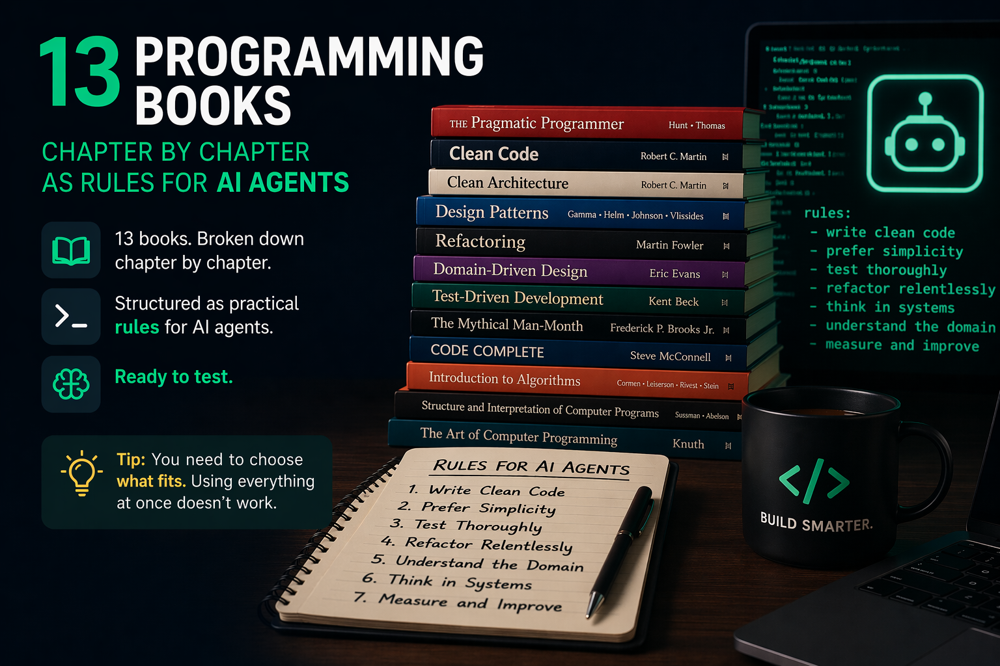

# 📚 AGENTS Book Rules



MIT licensed project rules for Codex, Cursor, and Claude Code.

This repository contains ready-to-use project rules for coding agents, based on well-known books about software design, architecture, refactoring, legacy code, reliability, and data-intensive systems.

Each set is a practical interpretation of a book's principles as instructions for AI coding tools. The goal is not to replace the books or copy their content. The goal is to make their most important engineering decisions easy to apply during everyday agent-assisted development.

The repository is organized as:

```text
<book>/
  codex/AGENTS.md
  cursor/.cursor/rules/<book>.mdc
  claude/.claude/rules/<book>.md
```

The repository also includes a synthesized default rule set:

```text
unified-software-engineering/
  codex/AGENTS.md
  cursor/.cursor/rules/unified-software-engineering.mdc
  claude/.claude/rules/unified-software-engineering.md
```

## Books

### A Philosophy of Software Design

Author: John Ousterhout

The book focuses on fighting complexity through deep modules, simple interfaces, information hiding, and design choices that reduce cognitive load. This rule set is especially useful for API design, module design, and refactoring shallow abstractions.

### Clean Architecture

Author: Robert C. Martin

The book describes designing systems around stable boundaries, the dependency rule, and the separation of business policies from details such as frameworks, databases, and UI. This rule set helps keep code resistant to technology churn.

### Clean Code

Author: Robert C. Martin

The book focuses on readability, naming, small functions, responsibilities, tests, and simplicity. This rule set is a strong default for everyday coding and code review.

### Code Complete

Author: Steve McConnell

The book covers a broad range of software construction practices: routine design, variables, classes, control flow, defensive programming, coding standards, and testing. This rule set helps agents make disciplined implementation decisions.

### Designing Data-Intensive Applications

Author: Martin Kleppmann

The book covers reliability, scalability, consistency, replication, partitioning, transactions, data streams, and schema evolution. This rule set is intended for systems where data ownership, event flows, and consistency semantics matter.

### Domain-Driven Design

Author: Eric Evans

The book introduces domain modeling, ubiquitous language, bounded contexts, tactical patterns, and strategic design. This rule set helps agents think in terms of the business model rather than tables, controllers, or DTOs.

### Domain-Driven Design Distilled

Author: Vaughn Vernon

The book is a short, practical introduction to DDD. It focuses on subdomains, bounded contexts, context mapping, and basic tactical patterns. This rule set is a good fit when you want the benefits of DDD without excessive ceremony.

### Implementing Domain-Driven Design

Author: Vaughn Vernon

The book shows how to apply DDD in real systems: aggregates, domain events, contexts, integrations, and application architecture. This rule set is more implementation-focused than `domain-driven-design-distilled`.

### Patterns of Enterprise Application Architecture

Author: Martin Fowler

The book catalogues enterprise application patterns: layers, service layer, transaction script, domain model, data mapper, repository, unit of work, identity map, DTO, and integration patterns. This rule set helps choose an appropriate pattern instead of mixing responsibilities accidentally.

### Refactoring

Author: Martin Fowler

The book describes safe ways to improve code structure without changing observable behavior. This rule set emphasizes small steps, tests, code smell detection, and keeping refactoring separate from feature changes.

### Release It!

Author: Michael T. Nygard

The book focuses on systems that survive production reality: failures, overload, timeouts, retries, circuit breakers, bulkheads, backpressure, observability, and deployment behavior. This rule set is useful for services, APIs, queues, integrations, and critical production paths.

### The Pragmatic Programmer

Authors: Andrew Hunt, David Thomas

The book describes a pragmatic approach to software development: responsibility, DRY at the knowledge level, orthogonality, automation, fast feedback, prototyping, and adaptability. This rule set works well as a general engineering layer.

### Working Effectively with Legacy Code

Author: Michael Feathers

The book explains how to safely change difficult, poorly tested code: characterization tests, seams, dependency breaking, sprout method, wrap method, and incremental risk reduction. This rule set is best for legacy work where the first goal is regaining control.

## Unified Rule Set

`unified-software-engineering` is a synthesized rule set that combines the unique principles from all supported books into one coherent agent instruction file.

It is not a concatenation of the book-specific rules. Repeated guidance is merged, and apparent conflicts are resolved through context-specific decision rules. For example, it tells the agent when a simple transaction script is enough, when richer domain modeling is justified, when production resilience matters more than ideal-path elegance, and how to preserve behavior during refactoring.

Use it when you want one broad default for general engineering work. Do not usually enable it together with every individual book rule set; that duplicates context and can make the agent less consistent. If a task needs a strong specialized lens, use `unified-software-engineering` alone or pair it with one focused rule set such as `release-it`, `refactoring`, or `working-effectively-with-legacy-code`.

## Choosing Rules

Do not enable all rules at once.

Reasons:

- they consume model context
- they may repeat the same ideas in different words
- they may have different priorities depending on the work
- the agent may follow an overly broad or inconsistent instruction set less reliably
- some books are situational, for example `Release It!` is critical for production systems but should not necessarily steer every simple UI change

Choose rules based on the task:

- broad default: `unified-software-engineering`
- everyday code quality: `clean-code`, `code-complete`
- architecture and boundaries: `clean-architecture`, `domain-driven-design`, `patterns-of-enterprise-application-architecture`
- domain modeling: `domain-driven-design`, `domain-driven-design-distilled`, `implementing-domain-driven-design`
- refactoring: `refactoring`, `a-philosophy-of-software-design`
- legacy code: `working-effectively-with-legacy-code`, optionally `refactoring`
- production systems: `release-it`
- data systems: `designing-data-intensive-applications`
- general engineering style: `the-pragmatic-programmer`

A good default is to start with one primary rule set and add a second only when it materially changes the agent's decisions. For a specific task, you can temporarily copy a rule into the project, use it during the work, then remove or disable it.

## Repository Layout

Each book directory contains the same three tool-specific variants:

```text
clean-code/
  codex/
    AGENTS.md
  cursor/
    .cursor/
      rules/
        clean-code.mdc
  claude/
    .claude/
      rules/
        clean-code.md
```

The naming convention is lowercase kebab-case:

```text
working-effectively-with-legacy-code/
designing-data-intensive-applications/
patterns-of-enterprise-application-architecture/
```

## Supported Tools

### Codex

Convention: `AGENTS.md`

Usage:

```bash
cp clean-code/codex/AGENTS.md /path/to/project/AGENTS.md
```

Codex loads `AGENTS.md` from the project directory and relevant parent directories based on where it is started. If you want rules to apply only to part of a repository, place `AGENTS.md` closer to that subdirectory.

### Cursor

Convention: `.cursor/rules/*.mdc`

Usage:

```bash
mkdir -p /path/to/project/.cursor/rules
cp refactoring/cursor/.cursor/rules/refactoring.mdc /path/to/project/.cursor/rules/
```

Cursor rule files include frontmatter with `description` and `alwaysApply`. If you copy multiple rules, consider changing `alwaysApply: true` to a more selective mode, or keep only the rules that should genuinely apply to every task.

### Claude Code

Convention: `.claude/rules/*.md`

Usage:

```bash
mkdir -p /path/to/project/.claude/rules
cp working-effectively-with-legacy-code/claude/.claude/rules/working-effectively-with-legacy-code.md /path/to/project/.claude/rules/
```

Claude can load rules from `.claude/rules/`. For larger rule sets, prefer a few well-chosen rules over one huge instruction file. Shorter, more specific context is easier for the model to follow consistently.

## Important Note

These rules are inspired by the books listed below. They are not official materials from the authors or publishers, and they are not a substitute for reading the books.

The files in this repository are practical engineering instructions written for AI coding tools. They intentionally avoid reproducing book text. Use them as lightweight working agreements, not as summaries or study notes.

## Constructive criticism from Reddit

Below is a consolidated list of recurring criticisms and suggestions from the Reddit discussion, ordered from the most valid to the least valid.

### 1. There is no clear measurement of improvement

**Validity: 9/10**

This is the strongest criticism. Without benchmarks, before/after comparisons, defect counts, review effort, or task-completion data, it is hard to know whether the rules actually improve code quality or just feel useful.

### 2. This can burn tokens and pollute the context

**Validity: 9/10**

Many of the generated rule files contain a large number of individual instructions. Loading too many of them at once can increase token usage, crowd out task-specific context, and make the agent less focused.

### 3. Skills, RAG, or progressive loading may be better than putting everything into `AGENTS.md`

**Validity: 9/10**

The rules are likely more useful when loaded selectively. Refactoring rules should be used during refactoring, legacy-code rules when working with legacy systems, data-intensive design rules when working on data-heavy systems, and so on.

### 4. A short set of project-specific rules may work better

**Validity: 9/10**

A compact `AGENTS.md` with 10–15 strong, testable, project-specific instructions may be more effective in daily use than a large generic rule set distilled from books.

### 5. The model may ignore many of the rules anyway

**Validity: 8/10**

LLMs do not reliably obey hundreds of instructions at the same time. More rules can increase coverage, but they can also create ambiguity, competition between instructions, and instruction fatigue.

### 6. Rules should also come from real project failures

**Validity: 8/10**

Book-derived rules are a useful starting point, but the most valuable agent rules are often based on actual incidents: the agent made a mistake, it caused a specific problem, and a new rule was added to prevent it from happening again.

### 7. Rules from different books may conflict

**Validity: 8/10**

Different books operate at different abstraction levels and sometimes encourage different tradeoffs. For example, rules inspired by Clean Code, Clean Architecture, DDD, DDIA, PoEAA, and A Philosophy of Software Design may push the agent toward different architectural decisions.

### 8. The approach may cause overengineering

**Validity: 8/10**

If the agent applies heavyweight architecture rules to a small feature or simple CRUD task, it may introduce unnecessary layers, abstractions, factories, ports, adapters, aggregates, or domain events.

### 9. The project could include more AI-agent-specific material

**Validity: 7/10**

Software engineering books teach good design, but AI coding agents also need operational guidance: tool use, planning loops, verification, test execution, avoiding guesses, scoped edits, and recovery from failed runs.

### 10. Too many abstract rules may lead to pseudo-compliance

**Validity: 7/10**

The agent may produce code that appears architecturally “proper” while still missing the actual task constraints. The risk is not that the rules are wrong, but that they may encourage surface-level compliance instead of practical correctness.

### 11. There may be legal or licensing concerns

**Validity: 6/10**

This is potentially important, but difficult to evaluate without legal analysis. A safer framing is that the project contains practical, original agent instructions inspired by software engineering principles, not substitutes for the books themselves. But... it's a destilled content taken from ChatGPT. So OpenAI had stolen books, I distilled ChatGPT, will OpenAI sue me for this?

### 12. The LLM may already know these books

**Validity: 5/10**

This is partly true, but incomplete. Models may know the principles, yet still fail to apply them consistently. Explicit context can help, but a full book-sized rule set is not automatically better than a short, targeted reminder.

### 13. Some principles may be outdated in the AI coding era

**Validity: 5/10**

AI changes the economics of writing, rewriting, and refactoring code. However, many core principles remain relevant: readability, modularity, testability, resilience, boundaries, and maintainability.

## Adding a Book

Use this convention when adding a new rule set:

```text
new-book-title/
  codex/AGENTS.md
  cursor/.cursor/rules/new-book-title.mdc
  claude/.claude/rules/new-book-title.md
```

Guidelines:

- use lowercase kebab-case for directory and file names
- provide all three variants: Codex, Cursor, and Claude Code
- keep rules operational and specific, not descriptive summaries
- avoid copying book text
- adapt principles into project guidance for implementation, refactoring, review, and testing
- keep Cursor `.mdc` files with frontmatter including `description` and `alwaysApply`
- add the book to the Books section with author and a short description
- avoid enabling every rule by default in downstream projects

## License

The code and rules in this repository are released under the MIT License. It is one of the simplest and most widely accepted open source licenses: it allows use, copying, modification, publication, distribution, and sublicensing with minimal restrictions.

See [LICENSE](LICENSE) for details.

## Author

[Maciej Ciemborowicz](https://maciej-ciemborowicz.eu)
